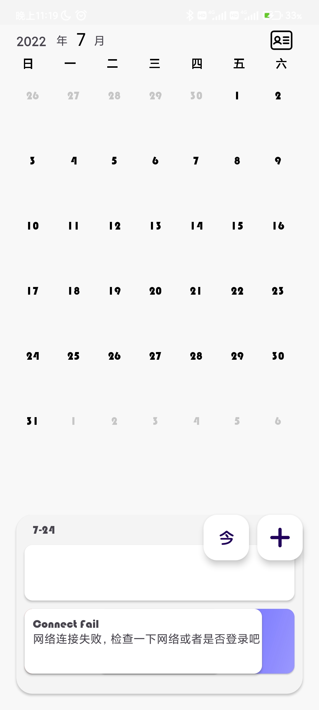
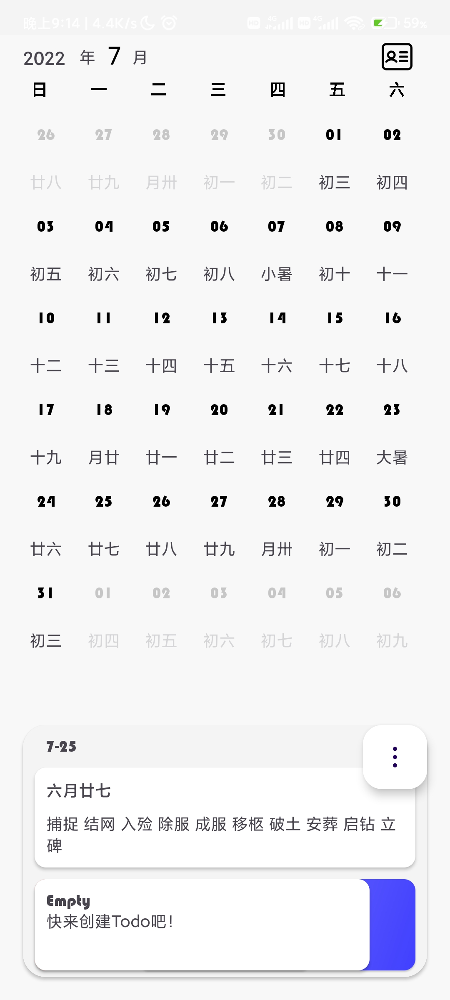
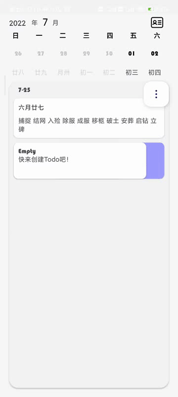
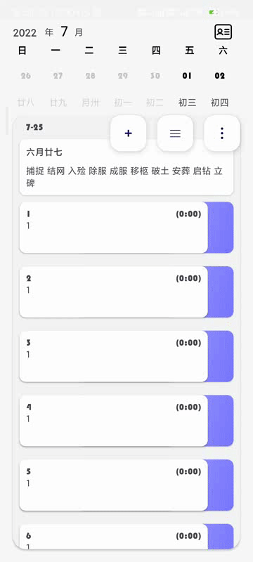
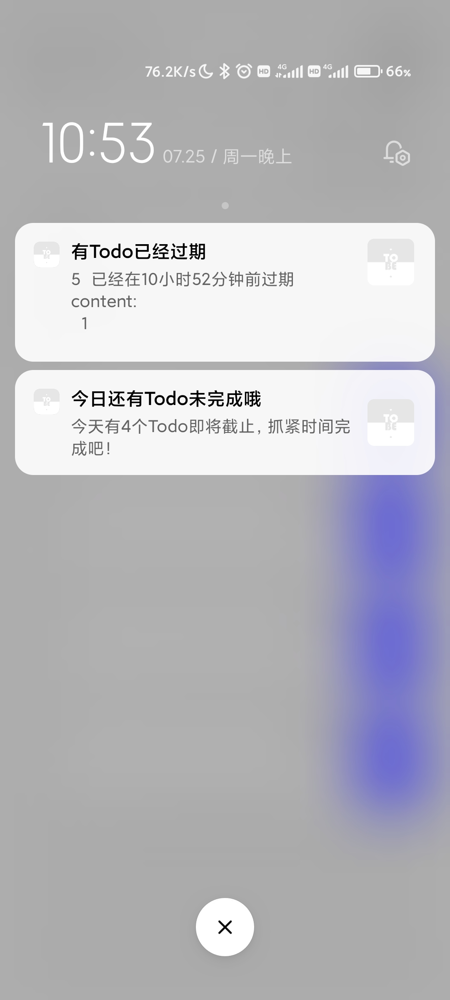

# ToBe

> ToBe是一个日历+Todo软件，你不仅可以通过它完成查看日期功能，还能够为你的日程添加Todo进行规划，通过后台通知来提醒你当日的Todo完成情况。

## 预览

## 

## 架构

本次的`Repository`针对无网络也做了一些处理

日历相关的数据在第一次使用app且没有连接网络时，会生成本地数据（但是没有节假日信息）；



在第一次联网时，则会获取网络数据，并将其缓存到数据库，之后就不再从网络获取数据，直接从本地获取。



Todo相关的数据则会根据加载情况发送加载中，网络连接失败，没有登录，数据为空等错误信息。同时也会做本地缓存。在本地有缓存的情况下，如果和远端数据不一致，则会更新数据

```kotlin
fun queryTodoList(status: Int = -1, date: String, priority: Int = 0, index: Int = 1) =
        flow {
            //转换格式
            val type = DateCalculator.formatDateForQueryHoliday(date).toLong()
            val local = TodoDatabase.getInstance().getTodoDao().queryTodos(date)
            if (local.isNotEmpty()) emit(local)
            else try {
                emit(loadingData)
                //根据status决定是去获取已经完成的、未完成的、还是所有的Todo
                val remote = ToDoService.INSTANCE.queryTodoListAll(
                    status = status,
                    type = type,
                    priority = priority,
                    index = index
                )
                //对远端数据和本地数据进行比较，根据结果决定是否发送数据
                if (remote.errorCode == 0) {
                    if (remote.data.datas.size != local.size) {
                        emit(remote.data.datas)
                        //比对两端数据，将改变后的数据更新到数据库中
                        updateTodoList(remote, local)
                    } else if (local.isEmpty()) {//都为空，则发送空数据
                        emit(emptyData)
                    } else {
                        var isSame = true
                        for (i in 0..local.size) {
                            if (remote.data.datas[i] != local[i]) {
                                isSame = false
                                break
                            }
                        }
                        if (!isSame) {
                            emit(remote.data.datas)
                            updateTodoList(remote, local)
                        }
                    }
                } else if (remote.errorCode == -1001) {//没有登录
                    if (UserRepository.tryLogin()) {//登录成功,再次发送请求
                        queryRemote(date, type, local, status, priority, index)
                    } else {
                        emit(loginFailData)
                        toast("没有登录")
                    }
                } else {
                    throw Exception(remote.errorMsg)
                }
            } catch (e: Exception) {
                e.printStackTrace()
                emit(connectFailData)
            }
        }
```

## 功能

### 日历

日历界面有着干净清爽的UI和比较丝滑的使用体验。主界面的日历没有使用`NestedScroll`,大多数滑动效果都是通过重写`View`，`ViewGroup`，`LayoutManager`来实现的。

使用：左右滑动上方月历部分来切换月份，左右滑动下方的日历部分来切换日期。水平滑动的同时上方的日期也会跟着移动

可以通过滑动上方的日历，下方的日期详情界面,或者是通过日期界面中的Rv来 折叠\展开 月历部分从而来达到切换 周视图\月视图 的效果。

### 

在周视图模式（折叠状态）下，因为重写了`LayoutManager`的`onLayoutChildern()`来实现刚好显示一周的日期，所以没办法在每次滑动结束时直接通过`LayoutManager`的`scrollToPosition()`方法来让日期滚动到指定位置。所以又不得不重写`LayoutManager`水平滑动的方法。


### 新增Todo

长按 菜单按钮(`...`形状)，会弹出新增Todo,切换查看`已完成\未完成`Todo的两个按钮。点击新增Todo的`+`形状按钮后，会进入新增Todo界面，有一些动画效果包括新增Todo按钮消失和菜单按钮的闪烁



通过滑动下方`Time`模块中的年月日，和时钟来设置新Todo的时间信息。点击右上角的`✔️`完成创建

### 查看\操作Todo



左右滑动Todo来暴露按钮，点击红色渐变按钮删除，点击蓝色渐变按钮完成Todo。点击切换菜单按钮查看已经完成的Todo。双击Todo修改该Todo的信息

### 后台提醒

通过一个运行在其他进程的`Service`，定时查询当日的Todo完成情况，包括提醒还有未完成Todo和已经逾期的Todo。



因为需要满足在`添加\删除`Todo后，Service能及时更改数据，所以需要通过`Binder`实现通信。这里通过`AIDL`然后重写`Stub`的方式完成（总不能要我手写吧）

## 不足

在自定义View方面还不够熟练，浪费了很多时间，而且最后的组件间耦合度比较高。对于Flow的使用不够熟练，有许多暗病.